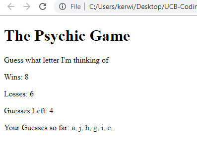

# psychic-game

## Summary
A letter guessing game. Very basic layout to showcase javascript functions. No use of css. Written with Javascript to control textContent in HTML elements. Played by typing with your keyboard!

*Rules explained in browser*

### **Functions:**
- Wins counter increases when the correct letter is guessed
- Losses counter increases when user runs out of guessed
- Ignores non-alphabet key presses
- New letter and guesses are reset whenever the player wins/loses
- Letters used updates everytime a new alphabet is typed

## Site Picture


## Technologies Used
- HTML
- Javascript
- Git
- GitHub
- VSCode

## Links
Live Page: https://seiretsym.github.io/psychic-game<br>
Repo: https://github.com/seiretsym/word-guess-game<br>
LinkedIn: https://www.linkedin.com/in/kerwinhy/<br>
GitHub: https://github.com/seiretsym<br>

## Code Snippet
I chose these lines of code because they were the most complex functions to write
```
// guess
function guess(key) {
    // check if key was used
    if (notUsed(key)) {
        // check if key is cpu key
        if (key === cpuLetter) {
            win();
        }
        // deduct remaining guesses if not
        else {
            textGuesses.textContent = parseInt(textGuesses.textContent) - 1;
            usedLetter(key);
            if (parseInt(textGuesses.textContent) == 0) {
                lose();
            }
        }
    }
}

// check if letter has been used
function notUsed(key) {
    var boolKey = false;
    for (var k = 0; k < usedChar.length; k++) {
        if (key === usedChar[k]) {
            boolKey = true;
        }
    }

    if (boolKey) {
        return false;
    }
    else {
        usedChar.push(key);
        console.log(usedChar);
        return true;
    }
}
```